# Turbofan Engine Remaining Useful Life (RUL) Forecasting

**Predicting when a jet engine will fail — before it does.**

An end-to-end predictive maintenance system that forecasts the Remaining Useful Life (RUL) of turbofan engines from multivariate sensor telemetry, using the NASA C-MAPSS dataset. The project spans classical ML baselines through deep sequence models with uncertainty quantification, model explainability, a deployed inference API and dashboard, and a production-style monitoring layer with automated drift detection and retrain triggers.

---

## Project Overview

**The problem:** In aviation and heavy industry, unplanned engine failure is expensive and dangerous, while purely time-based (fixed-schedule) maintenance wastes remaining useful component life. Predictive maintenance — estimating how many operating cycles remain before failure — allows maintenance to be scheduled exactly when needed.

**The solution:** This project builds and compares multiple RUL prediction models (classical ML, deep learning, and Transformer-based) on engine sensor data, selects the strongest performer, and wraps it in a deployable system: a FastAPI inference service, a Streamlit monitoring dashboard, and an automated data/prediction drift detection layer that decides when the model needs retraining.

**Objective:** Build a technically rigorous, reproducible, and deployable RUL forecasting pipeline that mirrors how predictive maintenance ML systems are built and operated in industry — not just a notebook that ends at a metric.

---

## Key Features

- Multi-model RUL benchmarking: Linear Regression, Random Forest, XGBoost, LSTM, GRU, and a Transformer model with uncertainty quantification
- Feature engineering pipeline with rolling statistics and degradation-aware signal transforms
- SHAP-based explainability for individual predictions
- Deployed FastAPI inference backend + interactive Streamlit fleet-monitoring dashboard
- Live Streamlit dashboard — no local setup required to explore the tool
- Automated data drift and prediction drift detection (Evidently, KS-test)
- Cost-based A/B simulation comparing model-driven maintenance vs. fixed-schedule maintenance
- Automated retrain-decision logic combining drift and performance-degradation signals
- Fully containerized with Docker for reproducible deployment
- Tested backend (pytest suite)

---

## Architecture / Workflow

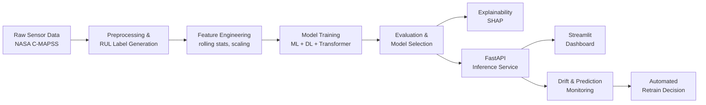

---

## Tech Stack

| Category | Tools |
|---|---|
| Programming | Python |
| Data Processing | Pandas, NumPy |
| Machine Learning | scikit-learn, XGBoost |
| Deep Learning | PyTorch (LSTM, GRU, Transformer) |
| Explainability | SHAP |
| Monitoring | Evidently, SciPy (KS-test, statistical testing), statsmodels (power analysis) |
| Experiment Tracking | MLflow |
| Backend | FastAPI |
| Frontend | Streamlit |
| Deployment | Docker, Streamlit Cloud |
| Testing | pytest |

---

## Dataset

- **Source:** NASA C-MAPSS (Commercial Modular Aero-Propulsion System Simulation) turbofan degradation dataset
- **Subsets used:** FD001 (single operating condition, single fault mode) and FD004 (multiple operating conditions, multiple fault modes — harder subset)
- **Structure:** Multivariate time-series per engine unit — operational settings + multiple sensor measurement channels per operating cycle, until failure
- **Target variable:** Remaining Useful Life (RUL) — number of operating cycles remaining before end-of-life
- **Records/features:** 20 training engines and 20 validation engines, with 20 sensor channels and 20,631 training records / 13,096 validation records after preprocessing.
- **Preprocessing:** RUL label generation, sensor scaling/normalization, exclusion of non-informative/leaking columns (e.g., a raw unscaled cycle-count column retained separately for interpretability), rolling-window feature engineering

---

## Machine Learning Approach

1. **Data preprocessing** — RUL label generation, train/validation split, feature scaling
2. **Feature engineering** — rolling statistics and degradation-signal features designed to capture trend behavior across cycles
3. **Model selection** — progressive complexity: linear baseline → tree ensembles → recurrent deep learning → Transformer with uncertainty quantification
4. **Training** — fixed random seed (`SEED = 42`) across all experiments for reproducibility
5. **Hyperparameter tuning** — Classical models were tuned using RandomizedSearchCV with 3-fold GroupKFold cross-validation, grouping by engine unit to prevent cycles from the same engine appearing in different folds. For the sequence models, sequence-length ablation compared 15, 30, 45, and 60-cycle windows. The Transformer used an architecture ablation across 2, 4, and 8 attention heads and 1 or 2 encoder layers; the 4-head, 2-layer configuration was selected.
6. **Evaluation** — RMSE compared across models and across dataset subsets (FD001, FD004)
7. **Explainability** — SHAP applied to the selected model to interpret individual predictions

---

## Model Performance

**RMSE by model and dataset subset:**

| Model | FD001 RMSE | FD004 RMSE |
|---|---|---|
| Linear Regression | 17.73 | — |
| Random Forest | 15.16 | — |
| XGBoost | 14.75 | 19.25 |
| LSTM | 11.17 | 24.64 |
| GRU | **10.40** | 25.48 |
| Transformer | 11.08 | **21.23** |

> Metrics beyond RMSE (MAE, R²) — > CMAPSS Score was tracked alongside RMSE as the primary domain-specific metric. MAE and R² were not used as standardized metrics in the final cross-model comparison. GRU was the strongest model on the simpler FD001 subset; the Transformer generalized best to the harder, multi-condition FD004 subset. XGBoost was selected for the deployed inference service due to its strong accuracy-to-complexity tradeoff and fast, dependency-light inference.

**Uncertainty quantification (FD001):** Two approaches were evaluated for prediction intervals — quantile regression and MC Dropout. Both showed unstable/under-calibrated coverage across reruns in current experiments; this instability is reported as a finding rather than a solved capability. Two approaches were evaluated for prediction intervals — quantile regression and MC Dropout. Both showed unstable/under-calibrated coverage across reruns in current experiments; this instability is reported as a finding rather than a solved capability.

---

## Explainability / Insights

Model predictions are interpreted using **SHAP**, identifying which sensor readings and engineered features drive each RUL prediction toward a shorter or longer estimate. This supports the real-world use case directly: a maintenance engineer isn't just told "this engine has 23 cycles left" — they can see *why*.

- **Important features/sensors:** `cycle`, `sensor_11_rollmean`, and `sensor_4_rollmean` were the top three features identified by both SHAP and permutation importance, with `cycle` ranking first.
- Business insight: model-driven maintenance timing was tested against a fixed-schedule baseline in a cost simulation (see Application section) to quantify potential savings

---

## Application / Dashboard

A Streamlit dashboard provides fleet-level and single-engine monitoring on top of the deployed model.

**Try it live:** [LIVE Dashboard](https://priyanshibarar22-turbofan-rul-forecas-appfinal-dashboard-yrt8c3.streamlit.app/)

**Engine Selection** — select an engine to view its individual RUL prediction, health status, operating-cycle history, and SHAP-based explanation

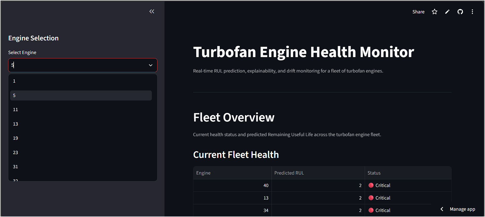

**Fleet Overview** — status and RUL summary across all engines (vectorized, batch-scored)

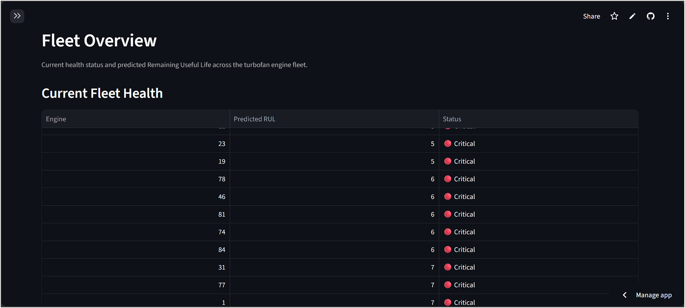
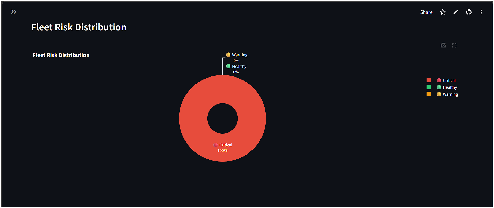

**Single Engine Drill-down** — RUL-over-time chart, health status, and SHAP "why this prediction" explanation

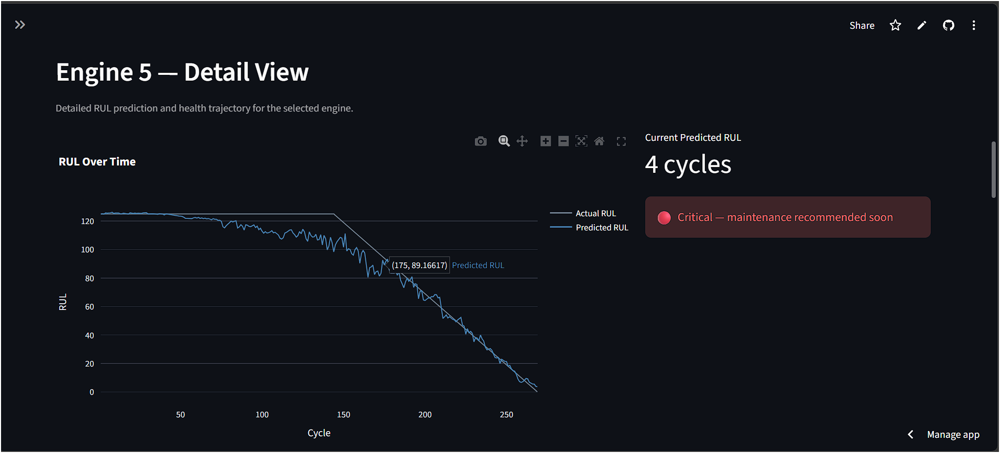
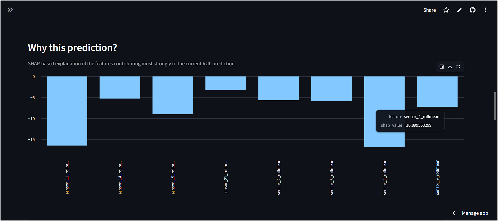

**Live Monitoring Simulation** — animated replay of an individual engine's operating cycles

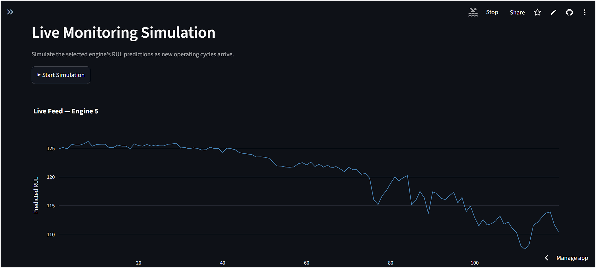
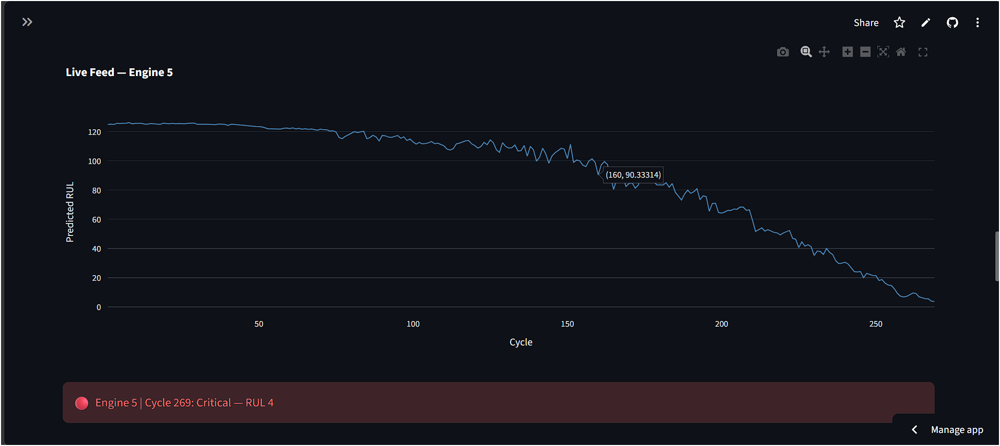

**Model Robustness & Drift Simulator** — interactive slider to artificially shift sensor data and observe live RMSE degradation

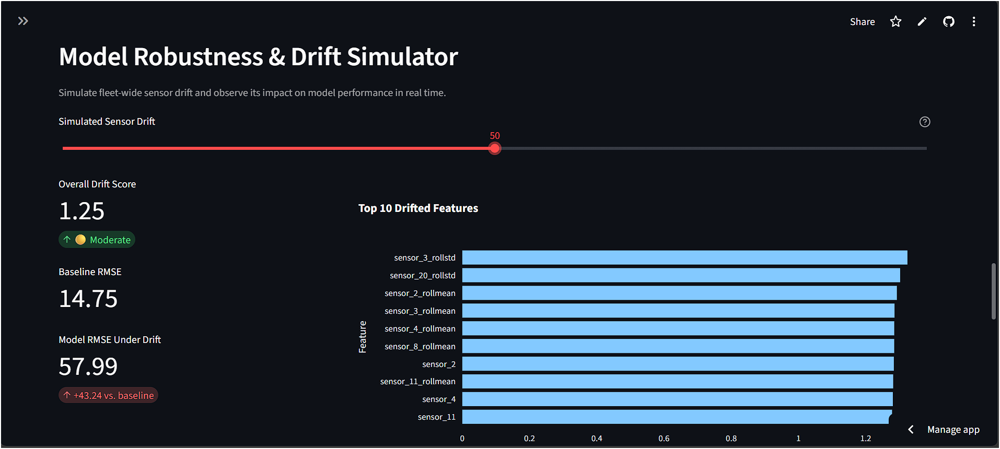

**Detailed Drift Reports** — embedded Evidently drift reports (baseline vs. current, and baseline vs. simulated drift)

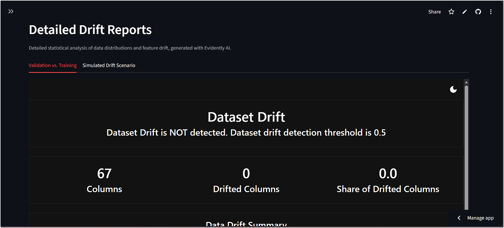
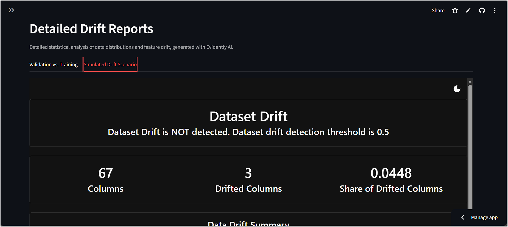
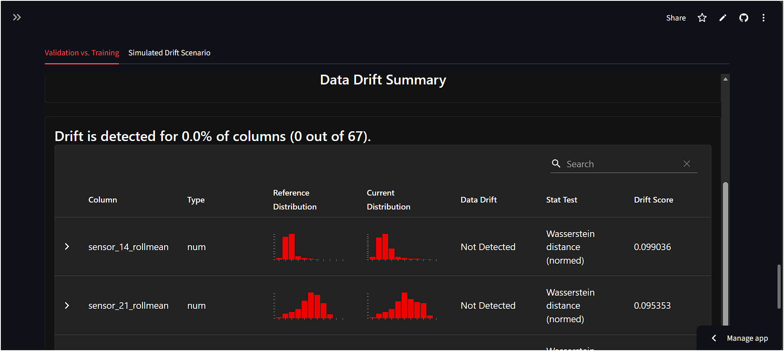
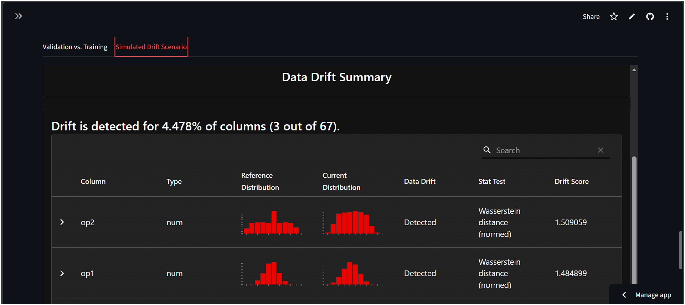

---

## Project Structure

```
turbofan-rul-forecasting/
│
├── app/                              # Deployment layer
│   ├── main.py                       # FastAPI inference service
│   ├── final_dashboard.py                  # Streamlit monitoring dashboard
│   ├── test_main.py                  # pytest suite for the API
│   ├── requirements.txt
│   ├── drift_report.html             # Evidently baseline vs. current
│   ├── simulated_drift_report.html   # Evidently baseline vs. simulated drift
│   ├── interactive_pca_embedding.html
│   ├── degradation_trajectory.gif
│   ├── project_scorecard_notebook6.csv
│   └── project_scorecard_notebooks1to5.csv
│
├── screenshots/                       # Dashboard screenshots used in this README
│   ├── current_fleet_health.png
│   ├──drift_simulator.png
│   ├──engine_selection.png
│   ├──fleet_risk_distribution.png
│   ├──live_feed.png
│   ├──live_monitor_simulation.png
│   ├──rul_overtime.png
│   ├──simulated_drift_scenario.png
│   ├──simulated_drift_scenario_data_drift_summary.png
│   ├──topfeatures_contributing.png
│   ├──val_vs_train.png
│   ├──val_vs_train_data_drift_summary.png
│
├── data/
│   ├── raw/                          # Original C-MAPSS files (not versioned — see .gitignore)
│   └── processed/                    # Train/val feature sets per subset (not versioned)
│
├── models/
│   └── xgb_fd001.pkl                 # Model served by the deployed API
│                                      # (deep learning checkpoints kept locally, not versioned)
│
├── notebooks/
│   ├── 01_eda.ipynb
│   ├── 02_feature_engineering.ipynb
│   ├── 03_deep_learning.ipynb
│   ├── 04_transformer_uncertainty.ipynb
│   ├── 05_explainability.ipynb
│   └── 06_monitoring_ab_testing.ipynb
│
|
├── .devcontainer/
│   ├── devcontainer.json
│   
│   
├── requirements.txt
├── README.md
└──.gitignore
```

---

## Installation & Setup

```bash
# 1. Clone the repository
git clone https://github.com/Priyanshibarar22/turbofan-rul-forecasting.git
cd turbofan-rul-forecasting

# 2. Create and activate a virtual environment
python -m venv rul_env
# Windows
rul_env\Scripts\activate
# macOS/Linux
source rul_env/bin/activate

# 3. Install dependencies
pip install -r requirements.txt
```

---

## Usage

**Option 1 — Use the live Streamlit dashboard (no setup required):**

Visit [LIVE Dashboard](https://priyanshibarar22-turbofan-rul-forecas-appfinal-dashboard-yrt8c3.streamlit.app/) to explore Fleet Overview, the Drift Simulator, single-engine drill-down, live monitoring, and drift reports directly in the browser.


**Option 2 — Run the notebooks** (in order, 01 → 06) to reproduce preprocessing, training, evaluation, explainability, and monitoring experiments.

**Run the API locally (without Docker):**

```bash
cd app
uvicorn main:app --reload
```

**Run the dashboard locally:**

```bash
cd app
streamlit run dashboard.py
```

> Both `main.py` and `test_main.py` use relative paths and must be run from inside the `app/` directory.

**Run the test suite:**

```bash
cd app
pytest test_main.py
```

---

## API Documentation

FastAPI service (`app/main.py`) exposes:

| Endpoint | Method | Description |
|---|---|---|
| `/health` | GET | Service health check |
| `/model-info` | GET | Returns metadata about the loaded model |
| `/predict` | POST | Returns a RUL prediction for a given engine's feature values |

---

## Results & Key Insights

- GRU achieved the strongest RMSE (10.40) on the single-condition FD001 subset; the Transformer was the most robust model (RMSE 21.23) on the harder, multi-condition FD004 subset — showing that architecture choice should follow data complexity, not a single "best model" assumption.
- The drift monitoring pipeline correctly distinguished real validation data (no false drift alarm) from an artificially shifted "stress test" (clear drift detected), validating the monitoring layer before relying on it in production.
- A cost-based A/B simulation showed a directional maintenance-cost saving under model-driven scheduling versus fixed-schedule maintenance, though not yet statistically significant at the tested sample size — an honest, evidence-based finding rather than an overstated claim.
- The automated `should_retrain` function combines input drift, prediction drift, and performance degradation into a single, deployable retraining trigger.

---

## Future Improvements

- Re-evaluate XGBoost on FD004 using the same engine subsample as the deep learning models for a fully consistent comparison.
- Improve uncertainty calibration (quantile regression / MC Dropout currently unstable)
- Expand the A/B cost simulation to a larger sample to reach statistical significance
- Add CI/CD for automated testing and deployment
- Extend monitoring with scheduled (not just on-demand) drift checks

---

## Learning Outcomes

This project demonstrates practical, end-to-end applied ML skills:

- Time-series feature engineering for sensor degradation data
- Comparative model development across classical ML, deep learning, and Transformer architectures
- Uncertainty quantification and honest reporting of its limitations
- Model explainability with SHAP
- Building and testing a production inference API
- Building an interactive monitoring dashboard
- Implementing data/prediction drift detection and automated retraining logic
- Applying statistical testing (t-tests, power analysis, effect size) to a real business decision
- Containerizing and deploying an ML system with Docker

---

## Author

**Priyanshi**
